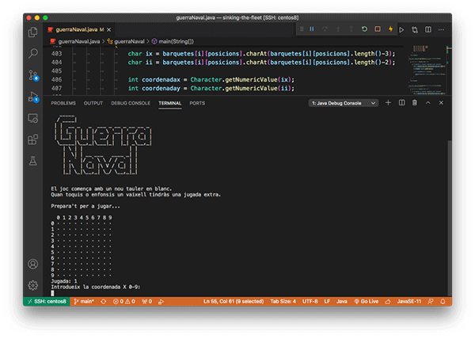

[Lea esto en **castellano**](README.es.md) · [Llegiu això en **català**](README.ca.md)

# Sinking the fleet

For educational purposes only, for basic programming students.

The game 'Naval Warfare' is an adaptation of a board game, is written in **Java** and is played on console with a scenario drawn with ASCII characters.

It is a practical example of modular programming with simple functions for observing the use of vectors and arrays, with data type transformation. It is much more fun than building a spreadsheet simulation `;-)`

The main function is brief, with calls to the auxiliary functions performing the operations. It is interesting to note that within the code are included test functions, which can be activated and deactivated in a timely manner.

The code is structured in a simple way and is self-explained through comments in Catalan, which can be easily translated using Google Translator or other translators. 

