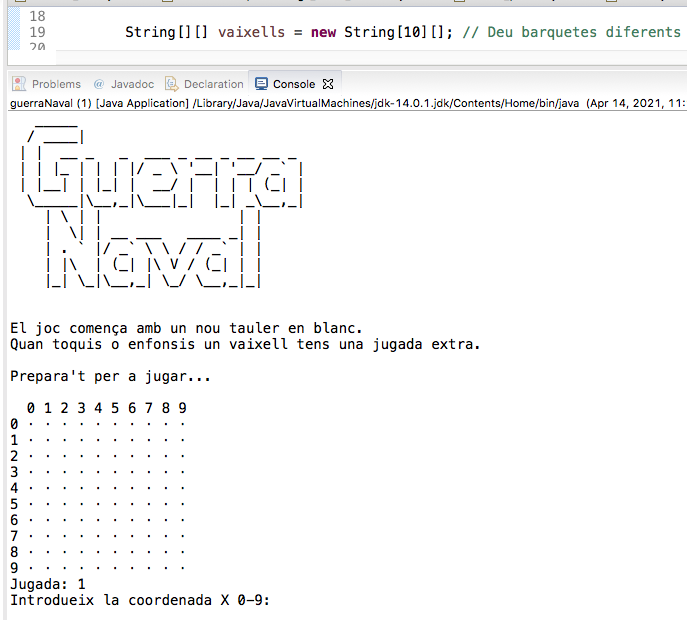

[Lea esto en **castellano**](README.es.md) · [Llegiu això en **català**](README.ca.md)

# Sinking the fleet

For educational purposes only, for basic programming students.

The game 'Naval Warfare' is an adaptation of a board game, is written in **Java** and is played on console with a scenario drawn with ASCII characters.

It is a practical example of modular programming with simple functions to observe the use of arrays with data type transformation. It is much more fun than building a spreadsheet simulation `;-)`

The main function is brief, with calls to auxiliary functions that execute operations. It is interesting to note that many other functions are included in the code, useful for examining the behavior of arrays, which can be turned on and off in a timely manner. 

The code is structured in a simple and uncomplicated way, although it is self-explained by simple comments in Catalan, which can be easily translated using Deepl, Google or other translators. 

